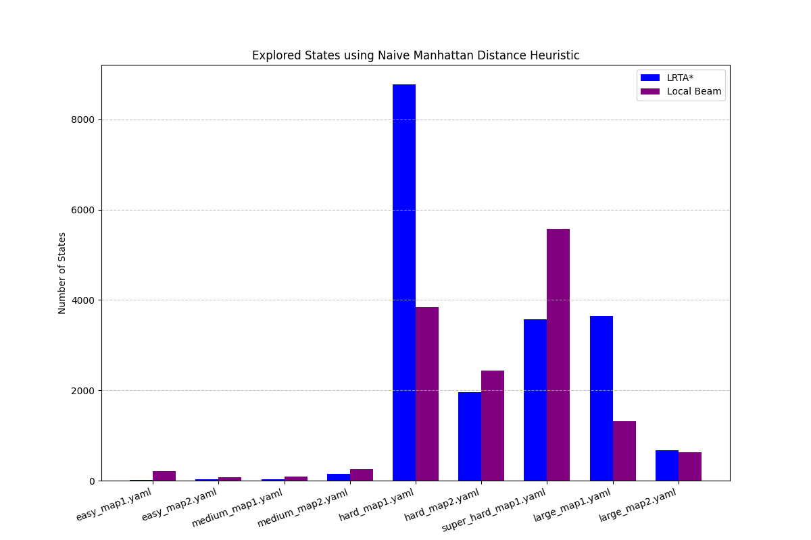
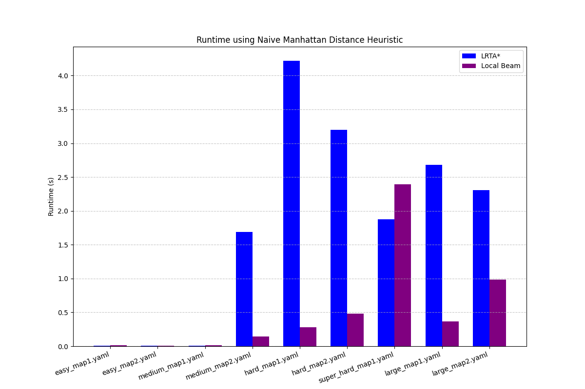
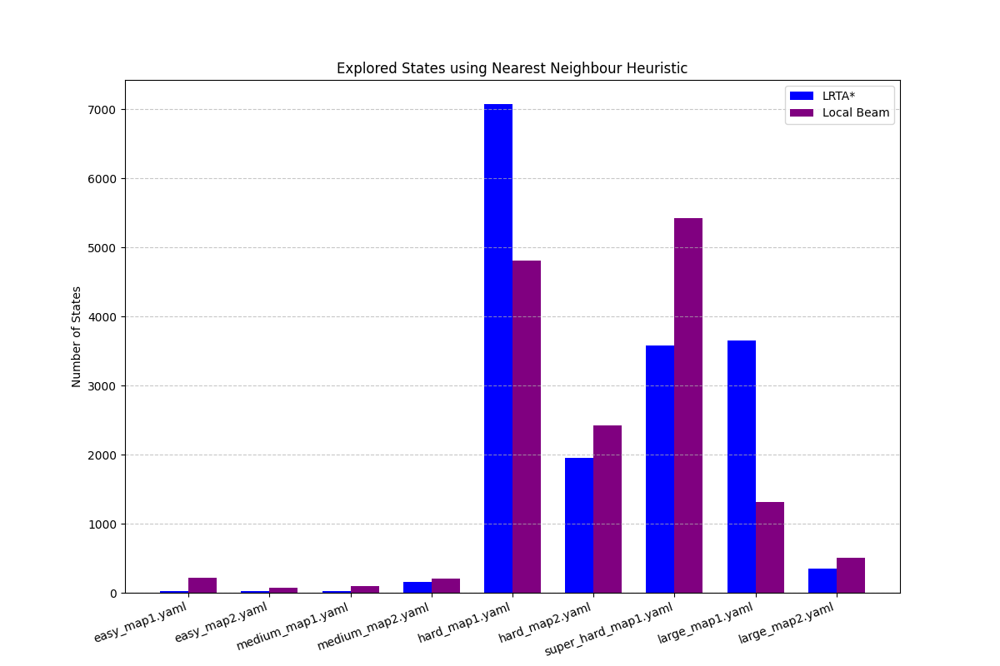
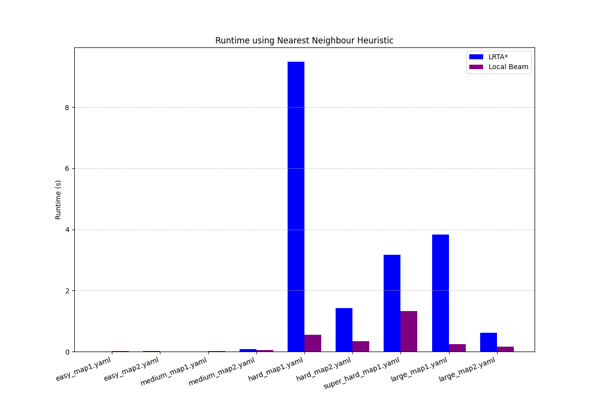
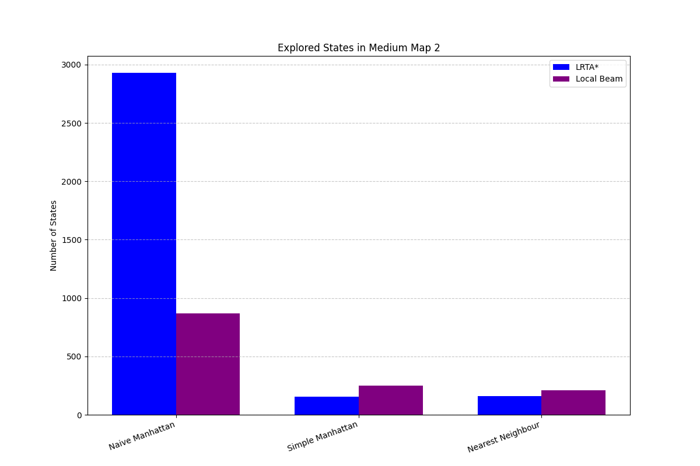
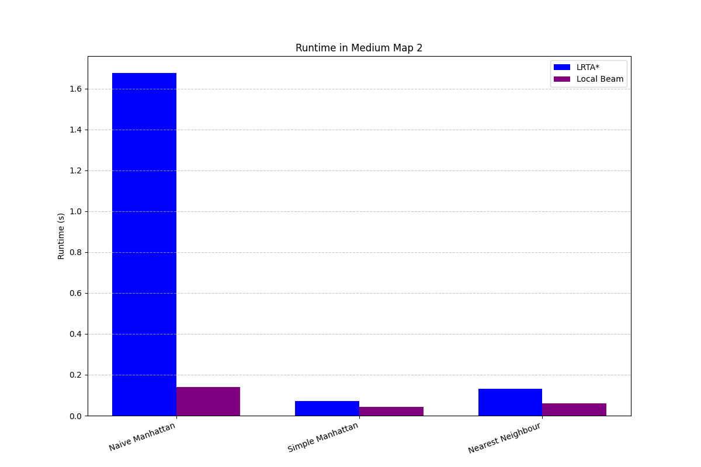

Copyright (c) 2025 Sabin Padurariu

# Solving Sokoban using State Search Algorithms

## General Overview

The aim of this paper is to show how games like Sokoban, games that have a
state representation, can be solved with the help of state search algorithms.

The agent uses informed heuristic functions to guide its search through the
state space of the game in order to find the solution in the minimum number of
iterations possible. 

## Gameplay and Key Ideas

Sokoban, meaning "warehouse keeper" in Japanese, is a puzzle video game in which
the player tries to place a fixed number of boxes from a warehouse into their
corresponding targets. The warehouse is represented as a grid, containing walls,
empty floor spaces, boxes, and designated storage locations.

Models with open spaces and irreversible actions can be problematic in
autonomous systems. Techniques such as informed search or reinforcement learning
can be used to address this issue in this particular domain.

The main idea involves teaching the agent to avoid undesired or unnecessary
actions that could lead to an irreversible state such as a deadlock scenarios.
The process implis designing a model that distinguishes between desirable,
neutral and undesirable game states.

## Search Algorithms

The paper focuses on two search algorithm that use heuristics to find the
optimal solution.

Local Beam Search leverages the heuristic function to search exhaustively
through the state space and stores the best k states found in every iteration in
order to extend the search to multiple paths at the same time.

Learning Real Time A* Search learns what could be the best states that lead to
the solution by using the heuristic function to guide its way through the state
space and updating the heuristic value of the visited states at every iteration.
In this way the algorithms learns about the environment and the desired, optimal
and undesired possible next states.

## Problems and Heuristics

### Naive Manhattan Distance Heuristic

The Manhattan distance heuristic for a Sokoban state is calculated by
considering each box individually and determining the Manhattan distance between
its current location and its closest target location. The overall heuristic
value for the state is then the sum of these individual minimum Manhattan
distances for all the boxes.

The Manhattan distance heuristic for Sokoban is admissible. This is a critical
property for A* search, guaranteeing that the first solution found is optimal.
The reasoning for admissibility is as follows: Each push operation can move a
box by one unit in either the horizontal or vertical direction. Therefore, to
move a box from its current position to a target location, at least the
Manhattan distance number of pushes is required in an unobstructed environment.
Since the heuristic calculates the sum of these minimum distances for each box
independently, it provides a lower bound on the total number of pushes needed
to get all boxes to their respective targets. It never overestimates the true
cost because it doesn't account for obstacles or the need to move other boxes.

Calculating the Manhattan distance is computationally inexpensive. For each
box, we need to compute the Manhattan distance to each target and find the
minimum

**Drawbacks**

1. A significant limitation of the Manhattan distance heuristic is that it
completely disregards the presence of walls and other boxes within the
warehouse. The straight-line Manhattan distance between a box and a target
might be physically impossible to achieve due to obstructions. The player
might need to make numerous additional moves to maneuver around these obstacles,
making the actual number of moves significantly higher than the heuristic
estimate.

2. The heuristic treats each box independently and calculates its distance to
the nearest target. However, solving Sokoban often requires a sequence of moves
where the positioning of one box can affect the ability to move other boxes.
The heuristic fails to capture these crucial interdependencies

### Simple Manhattan Distance Heuristic

The Nearest Neighbors heuristic for Sokoban operates by considering each box
and finding the closest target location to it, typically measured by the
Manhattan distance. However, unlike the basic Manhattan distance heuristic
which simply sums these minimum distances, the Nearest Neighbors heuristic
aims to establish a one-to-one assignment between boxes and targets.

Unlike the simple Manhattan distance heuristic, the Nearest Neighbors heuristic
attempts to establish a more realistic mapping between boxes and targets. By
assigning each box to a unique target, it implicitly acknowledges that each
target can only accommodate one box in the goal state. This can lead to a more
informed estimate of the remaining work compared to simply finding the closest
target for each box independently.

If the cost of moving a box is directly proportional to the Manhattan distance,
and each target must be occupied by exactly one box, the Nearest Neighbors
heuristic can be admissible. The reasoning is that for each box, we are
considering the minimum cost to reach some unoccupied target.

**Drawbacks**

1. Still Ignores Obstacles and Walls. Similar to the basic Manhattan distance,
the Nearest Neighbors heuristic operates solely on grid coordinates and does
not take into account the presence of walls or other boxes that might obstruct
the path.

2. Greedy Assignment Can Lead to Suboptimal Estimates. The greedy nature of
assigning each box to its nearest available target might not always reflect
the optimal overall assignment.

3. Complexity of Implementation. Implementing the Nearest Neighbors heuristic
requires a mechanism to keep track of assigned targets and efficiently find the
nearest unassigned target for each box.

### Nearest Neighbour Heuristic

While Breadth-First Search (BFS) is primarily known as an uninformed search
algorithm, it can be adapted or utilized to generate heuristic estimates for
Sokoban puzzles. The core idea is to use BFS to pre-compute the minimum number
of moves required to achieve certain simplified subgoals or to reach specific
configurations from the current state. This pre-computed cost can then serve as
a heuristic value.

Unlike the Manhattan distance, a BFS-based heuristic inherently takes into
account the walls present in the warehouse. The pre-computed distances would
reflect the shortest paths around obstacles, providing a more realistic estimate
of the number of moves required for individual boxes.

If the BFS is performed to find the shortest push sequence for a single box to a
target, considering only walls, and the heuristic sums the minimum such costs
for each box to its closest target, it could potentially be admissible. 

**Drawbacks**

1. Computational Cost

2. Ignores Box-Box Interactions. Similar to the Manhattan distance, a BFS
focused on individual boxes and walls does not account for the interactions
between boxes. One box might block the path of another, making the individually
calculated shortest paths infeasible in the actual game.

3. Admissibility Challenges. Ensuring admissibility when using BFS in this way
requires careful consideration. Simply summing the shortest paths for individual
boxes might overestimate the true cost if the optimal solution requires
coordinated movements that make these individual paths longer.

### All Heuristics

Manhattan Distance is the simplest and computationally cheapest, providing a
basic but often weak admissible heuristic.

Nearest Neighbors attempts to improve upon Manhattan distance by considering
the one-to-one box-target relationship, potentially leading to a tighter bound
at a slightly higher computational cost.

BFS-based Heuristic tries to incorporate the warehouse layout (walls) into the
estimate, which can be more accurate for individual box movements but can be
computationally expensive and still struggles with inter-box dependencies.

